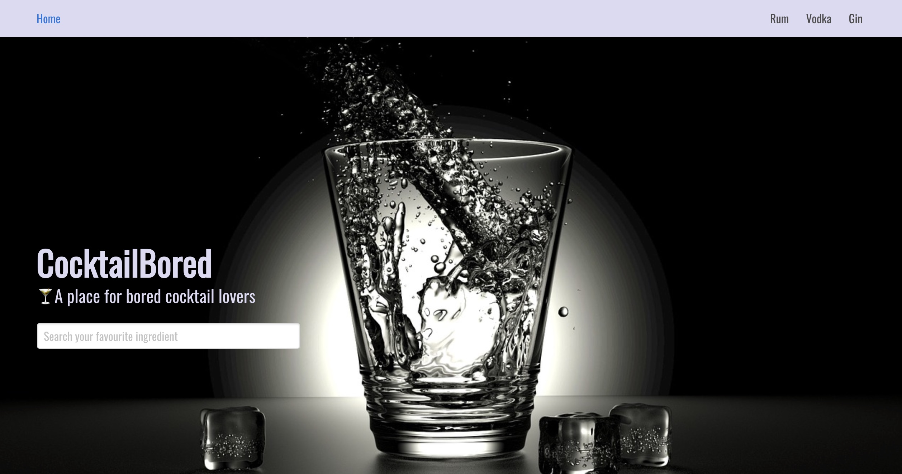
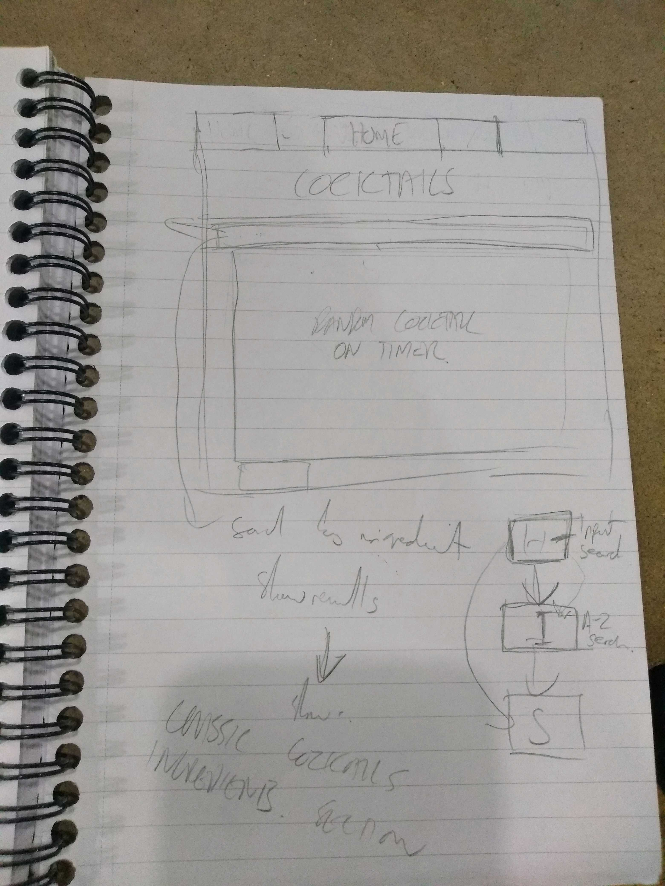

# GA Project 2: CocktailBored 



### Link

[CocktailBored](https://acadonis.github.io/Project-2/#/)

### Installation

Fork the repository

Clone the repository down to your local system

Run **npm i** in the terminal to install dependencies

Run **npm run serve** in the terminal to load the app

### Brief

Over a two day "Reacathon", my colleague and I were tasked with building a React appliction which consumed a public API. 

The MVP requirements were that it:

* Included both classical and functional components
* Included a router with multiple pages
* Had a design lead by wireframes produced prior to development of the app
* Was deployable online

### Timeframe

Two days

### Overview & concept of the project

The idea for CocktailBored was inspired by a shared love of cocktails, together with the age old problem of never having the right ingredients to hand for a particular receipe. 

We decided to reverse the process by starting with the available ingredients rather than the name of the cocktail, and allowing the user to search by ingredients to narrow down their available options. 

Considering the purpose of the app, we considered an attractive and sylish design to be essential, and made the decision to use Bulma to achieve this from the outset of the project. 

### Technologies used

React, Javascript ES6, axios, Insomnia, Bulma, HTML5, CSS 3, SASS, Git, Github

### Approach taken

Our first decision was to agree on pair-programming the app, working on a single laptop, given the limited two day window and need to work closely together to agree functionality and design elements. 

We then reviewed the available public APIs that had information on cocktails available. After reviewing that it would fit with our ingredients led approach, we chose [TheCocktailDB](https://www.thecocktaildb.com/) due to it's large number of cocktails easily searchable by ingredients.

Our next stage involved setting up a Trello board with key tasks, followed by a UX wireframing session to work through and agree the design of the app.

We quickly realised that the best design, given the purpose of the app to allow the user to search by ingredients, was an eyecatching homepage with a single search functionality (by ingredient). 

This would then lead the user to an index page where they would either have the option to browse the results of this initial search, or refine it further, before a final show page with information on their cocktail of choice.



With the design agreed, we moved onto the technical implementation of the project. 

Our underlying soltuion used axios to handle our requests, and the React setState method to render the DOM. Using a React component based structure, with both classical and functional components, allowed us to reuse components such as the Navbar where possible, and minimise duplication of code. 

Using react-router allowed for a clearly structured app.js, with the url paths allowing navigation by way of the unique ingredient names or drink ids drawn from the API. For example, the ingredients search routing from the main page follows the below routing:

```javascript
<HashRouter>
  <Navbar />
  <Route path="/search/:spirit" component={CocktailsIndex} />
</HashRouter>

===========================

handleSubmit(){
    this.props.history.push('/search/' + this.state.searchTerm)

===========================

componentDidMount(){
    axios.get('https://www.thecocktaildb.com/api/json/v1/1/lookup.php?i=' + this.props.match.params.id)
      .then(res => this.setState({ cocktail: res.data.drinks }))
}
```
The search and filtering function was the key functional aspect of the app, and as such the code behind this is paramount. Forming two parts, the first search on the homepage narrows down the results fetched from the API by the "strIngredient" property as above, with further filtering on the results page by name of cocktail using RegEx and the Lodash library ```javascript _.filter ``` and / or alphabetical sorting using ```javascript _.orderBy ```:

```javascript
this.state = {
      cocktails: [],
      searchTerm: '',
      sortTerm: 'name|asc',
      selectedOption: ''
    }
    
===========================
  
  filterCocktails(){
    const re = new RegExp(this.state.searchTerm, 'i')
    const [field, order] = this.state.sortTerm.split('|')

    const filterCocktails = _.filter(this.state.cocktails, cocktail => {
      return re.test(cocktail.strDrink)
    })
    const sortedCocktails = _.orderBy(filterCocktails, [field], [order])

    return sortedCocktails
  }
  
===========================

<div className="field">
  <input placeholder="Search your favourite drink" className="input" onKeyUp={this.handleKeyUp}/>
</div>

<label> Alphabetical Order:  </label>
<select onChange={this.handleChange}>
  <option value="strDrink|asc">A-Z </option>
  <option value="strDrink|desc">Z-A </option>
</select>
```

We also decided to pre-populate a number of searches and include these on the Navbar to allow the users to access a list of cocktails by a single click. 

### Styling

As part of our planning, we decided to implement a mobile-first design approach with responsive web design. Using Bulma allowed a relatively "out of the box" approach", but none the less additional customisation was required using a multiline columns approach with the card component. 

We made a conscious decision not to clutter pages with two much information, instead preferring to limit the text on the screen and make use of large blocks of colour to give the site a spacious and relaxed feel. Given the prevalence of limited text on simple backgrounds, text and colour palette were key. 
 
 We used Bulma variables and custom classes with SASS to tweak the underlying Bulma templates, but were conscious not to "fight" overly with the default Bulma settings:

```CSS 
@import url('https://fonts.googleapis.com/css?family=Oswald&display=swap');

$family-primary: 'Oswald';
$body-background-color: hsl(179, 3%, 90%);
$navbar-background-color: hsl(246, 46%, 90%);
$card-background-color: hsl(218, 17%, 21%);
$radius-large: 6px;


.card-content{
  color:hsl(179, 3%, 90%);
}

.card{
  border-radius: 10px;
}
```
Overall I consider the styling effective, working well with the existing images being supplied by the API, and giving the clean and uncluttered look we were aiming for:

### Wins and Blockers

#### Wins:
* The search functionality works as intended, allowing the user a simple and effective way of searching for cocktails to make.

* Prior research on the API meant that the information available through requests was that required by the app.

* Strong design which puts the product at the heart of the user experience.

* Succinct and well structured code throughout.

#### Blockers:
* Each pre-populated search on the nav bar has it's own component, when ideally a single component would be used to load each search, with the ingredient passed in as a variable depending on the link clicked. 

* I sucessfully tackled a more advanced version of this issue in Project 3 - Happenings, which is detailed in the project readme.

* The site is responsive but we strayed slightly from the mobile-first design approach. This again was tackled in Project 4, where the design approach was truly mobile-first.

### Future features

* Introduce the ability to search by multiple ingredients 
* A comparison function to compare cocktails
* Making the prepopulated searches use a single component. 

### Learning points (tech & soft skills)

#### Methodology
The experience of working with a colleague pair programming was invaluable. Having a second person to come up with ideas, suggest alternatives, and check code as it is typed saves time and leads to a more rounded product. 

The hackathon format of the project meant that all time had to be used productively, and it was an interesting exercise to  balance when to start the technical development versus conducting sufficient preparation. I am happy that we struck this balance relatively well for our first such project. 

#### Technical
This project honed my skills with React, and advanced my understanding of the React set lifeycycle greatly. Understanding when render is called and React reconciliation overall I found key to this, combined with ensuring that all information to be displayed to the user is set by setState, and state is never modified directly. 

It also increased my knowledge of APIs, both in terms of using axios to retrieve information, and in researching the capabilities (and importantly) limitations of APIs prior to deciding to use them through their documentation. 


